<p align="center">
  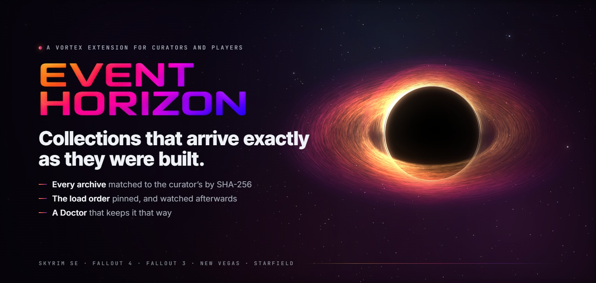
</p>

<p align="center"><b>A Vortex extension that installs a collection exactly as its curator built it — every archive checked by hash, the load order pinned — and then keeps it that way.</b></p>

<p align="center">
  <a href="https://github.com/ReidenXerx/Event-Horizon/actions/workflows/tests.yml"></a>
  <a href="https://www.virustotal.com/gui/file/c9148aad012be57854af257497569093724f5653a143ddbda582eb5f5db2cbbc"></a>
  <a href="https://github.com/ReidenXerx/Event-Horizon/blob/master/LICENSE"></a>
  <a href="https://github.com/ReidenXerx/Event-Horizon"></a>
</p>
<p align="center">
  <a href="https://github.com/ReidenXerx/Event-Horizon"></a>
  <a href="https://github.com/ReidenXerx/Event-Horizon/commits"></a>
</p>
<p align="center">
  
  
</p>

<p align="center"><a href="https://www.nexusmods.com/site/mods/2235"><b>Download on Nexus Mods →</b></a> &nbsp;·&nbsp; <a href="CHANGELOG.md">Changelog</a> &nbsp;·&nbsp; <a href="https://discord.gg/JcaXUzWQqF">Discord</a></p>

<p align="center">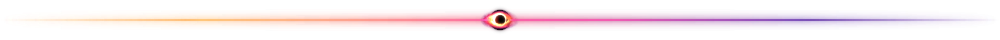</p>

## Built in public, and nothing to run but JavaScript

- **No executable, no DLL, no native code.** The release zip is the JavaScript that Vortex loads: script files, their source maps, a licence and one icon. The programs it ever starts are ones you already have — your game, through Vortex's own launcher; Vortex's own 7-Zip; Windows' `reg.exe`, to read which runtimes are installed — and Microsoft's runtime installers, downloaded from Microsoft, only when you press *Install the missing ones*.
- **Every push runs the whole test suite** on [GitHub Actions](https://github.com/ReidenXerx/Event-Horizon/actions/workflows/tests.yml); the tests badge is that run's live count.
- **Scanned on VirusTotal.** The badge is generated from the scan and names the build it covers, and turns red by itself if the result ever changes.

## What it is

Event Horizon is a Vortex extension in two halves. **Curators** get a workbench that sees the whole profile at once, reads what every mod needs, and packs the exact working setup into a package. **Players** get an installer that rebuilds that setup one mod at a time, proves every archive matches, pins the curator's load order — and a Doctor that says so the moment anything drifts.

> **A Vortex collection:** *"Here are the mods. Install them."*
> **An Event Horizon collection:** *"Here is the exact state that worked. Rebuild it, and prove it matches."*

### New in the 0.2 beta

- **Collections live on Nexus.** Press *Add collection* on an Event Horizon collection's Nexus page and Event Horizon opens its install. When the curator publishes a new revision you are offered the update when Vortex starts and on the collection's card; it installs into its own profile, so the version you were playing stays one click away.
- **A new look.** Home is a dashboard: the collection you are playing, how healthy it is, what your game is made of and what modding costs your disk.
- **A different game version is a warning, not a wall.** If the curator played on another version, you are told exactly which mods care, and you decide.
- **Missing runtimes, found and fixed.** The Microsoft runtimes that script-extender plugins, xEdit and ENB need are checked before an install and in the Doctor, with a button that installs the missing ones.

<p align="center">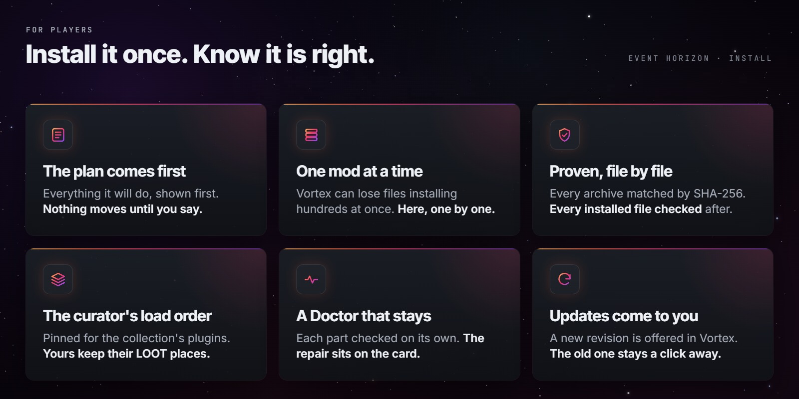</p>

<p align="center">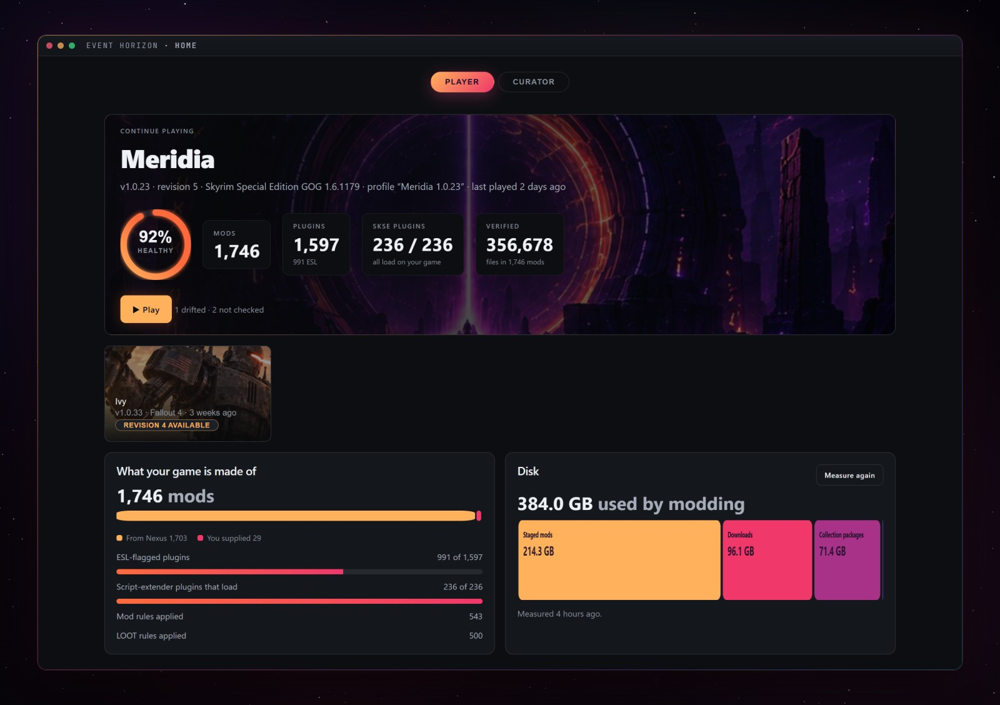</p>

## For players

- **Your game setup is checked first.** An unmanaged game, a game that was never started, a file from another store's copy, an install under Program Files — the install stops with the steps to fix it, not an hour in.
- **The plan before anything changes.** What you already have, what installs by itself, what needs you, what can no longer be downloaded — shown under the curator's own banner, screenshots and About page.
- **One mod at a time, every archive checked.** Vortex can lose files when hundreds of mods install at once, so Event Horizon installs them one by one and matches each download to the curator's by SHA-256. The curator's installer answers are replayed; you choose once whether to watch them or let them apply.
- **Proof at the end.** Every installed file is checked against the curator's, and the finished install says how many.
- **Interrupted? It carries on.** Even after Vortex was killed, the install continues where it stopped, in the same profile. Every ending leaves a record under **My Collections**.
- **The load order stays the curator's.** The collection's plugins are pinned in the curator's order and yours keep the places LOOT gives them. When Vortex's automatic sort or a Sort click replaces that order, a notification says so, with the fix on it.
- **The Collection Doctor.** The profile, the mods, which are enabled, the files on disk, plugin order, ESL flags, mod rules and LOOT rules — each checked on its own card, and *not checked* is never shown as *fine*. Every problem that can be repaired has its repair on the card. Your own additions are counted, not flagged.

<table>
<tr>
<td width="50%">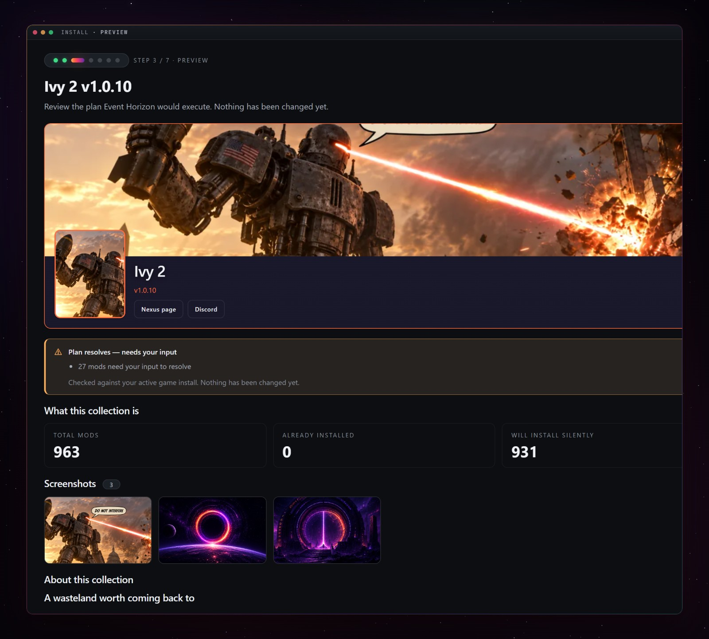<br><sub><b>The plan.</b> Nothing changes until you say so.</sub></td>
<td width="50%">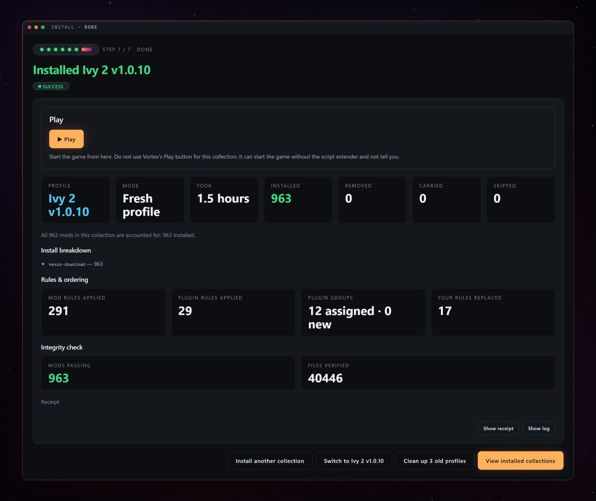<br><sub><b>The proof.</b> Every mod accounted for, every file verified.</sub></td>
</tr>
<tr>
<td>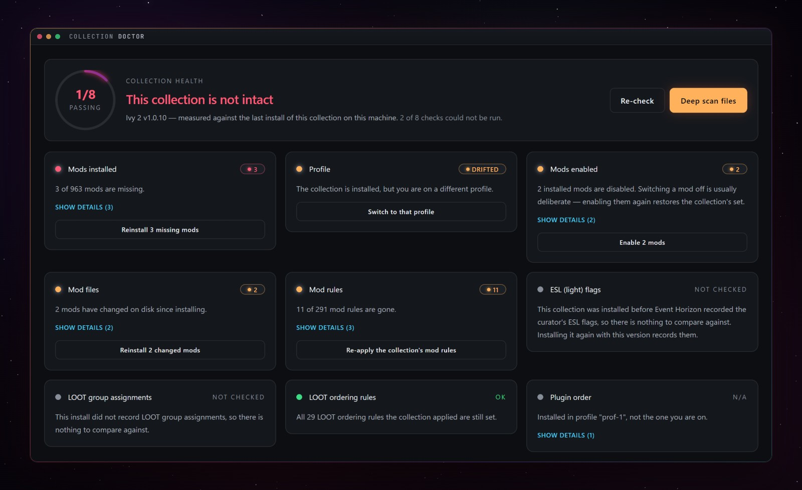<br><sub><b>The Doctor.</b> Each part on its own card, the repair on the card.</sub></td>
<td>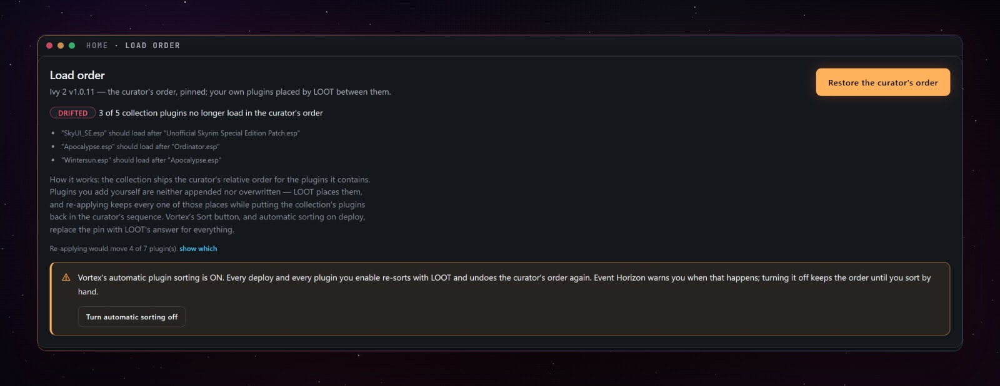<br><sub><b>Load order, watched.</b> A sort that undoes it is caught.</sub></td>
</tr>
</table>

When something goes wrong, open the **Doctor** and press **Save logs…**: Vortex's and Event Horizon's logs, the install records and your script extender's log, in one zip.

<p align="center">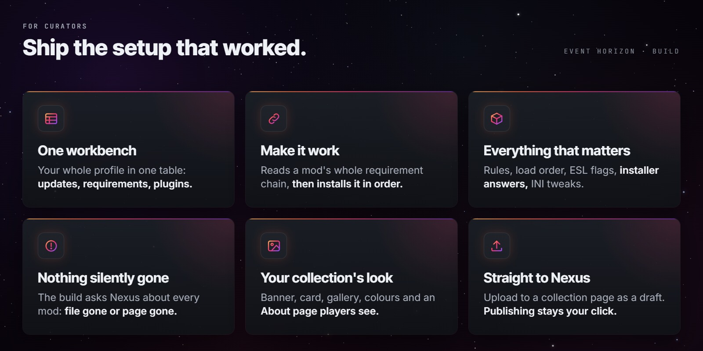</p>

## For curators

- **One workbench for the whole profile.** Updates, manual updates, frozen mods, missing requirements, mods others depend on, duplicates, disabled mods, plugins, and downloads nothing was ever made from — in one table. Views combine, a search box finds a mod, a requirement or a plugin by name, and the action bar offers only what applies to what you ticked.
- **Requirements, read and acted on.** Every mod's Nexus requirements and every plugin's masters, resolved against your pool: satisfied, installed but disabled, missing, off Nexus, DLC — each with the one action that fits.
- **Make it work.** One button reads the whole chain of what a mod is missing — each requirement's own requirements too — shows the plan, lets you choose where a page ships several files, then installs in dependency order. Without Nexus Premium it runs guided, one page at a time.
- **Bulk update, one mod at a time,** each verified against its archive afterwards. **Freeze** a mod at a version and be told loudly if Vortex's own update button moves it anyway. **Endorse** with Nexus's answer read back per mod.
- **Notes** on a mod. Start one with `@users` and it ships in the collection, shown to installers under *From the curator*.
- **Build.** Every archive's SHA-256, the mod rules, the LOOT userlist and groups, plugin order and ESL flags, the installer answers and INI tweaks, recorded. The build asks Nexus about every mod and separates *file gone* from *page gone* — you are the one person who cannot notice, because your copy is already on disk. It warns, and you decide.
- **Your collection's look:** a banner, a card image, screenshots, colours, links and an About page, shown to everyone who installs it.
- **Straight to Nexus:** upload a finished build to a collection page of yours as a draft revision — publishing stays your click. Players who add it there get Event Horizon's install and are offered every update you publish.

<table>
<tr>
<td width="50%">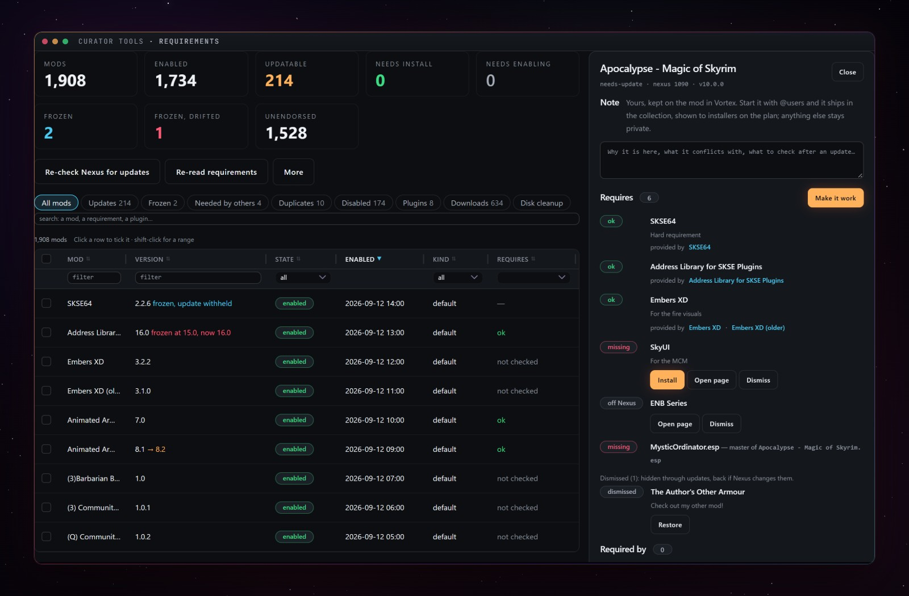<br><sub><b>Curator Tools.</b> The whole profile in one table, the inspector beside it.</sub></td>
<td width="50%">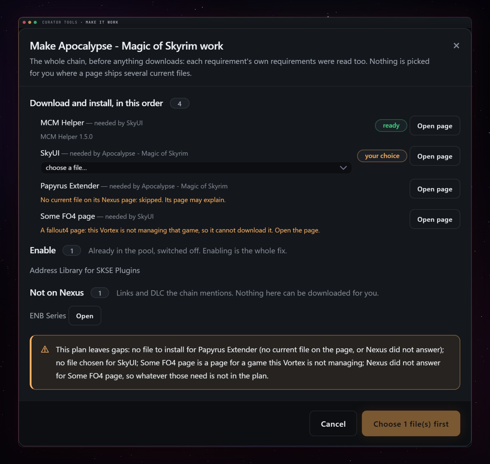<br><sub><b>Make it work.</b> The whole chain, read to the bottom, installed in order.</sub></td>
</tr>
<tr>
<td colspan="2">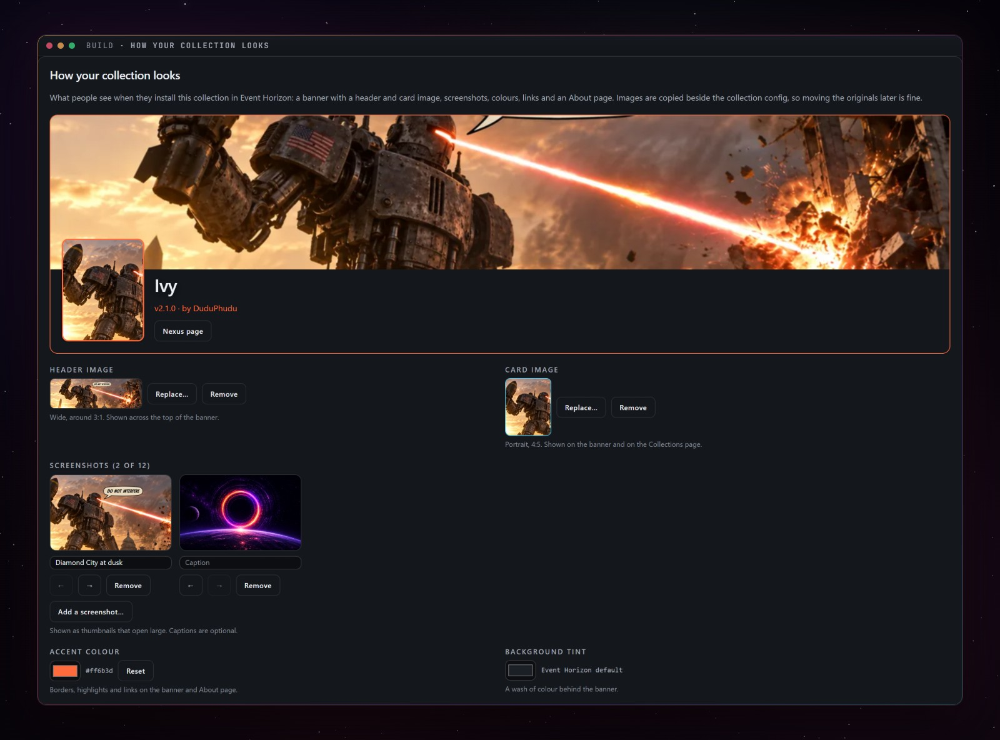<br><sub><b>How your collection looks.</b> What players see when they install it.</sub></td>
</tr>
</table>

<p align="center">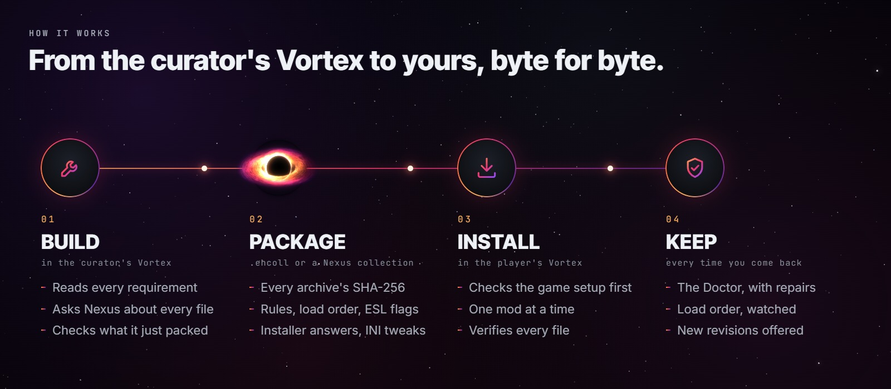</p>

<details>
<summary><b>Which mod wins a file</b></summary>

When two mods ship the same file, the winner comes from the collection's mod rules, which the install applies. Measured on a 1,753-mod collection, the rules reproduce the curator's winner for 17,159 of 17,161 contested files; the other two are a `Readme.txt` and a `FOMod/info.xml`, which the game never loads.
</details>

## Tech deep dive: vanilla Vortex vs Event Horizon

The Vortex side is read from Vortex 2.7's own source.

| | Vanilla Vortex collections | Event Horizon |
|---|---|---|
| **Identity** | Nexus file id plus the archive's MD5; a mod set to "latest" installs whatever is newest. | The curator's exact file, with a SHA-256 of the archive and of every file it installs. |
| **Installing** | Up to five mods at once. | One at a time, then every one checked. |
| **Checking** | Trusts what the installer extracted. | Re-hashes every installed file against the curator's record, repairs what differs, and names what it can't. |
| **The curator's edits** | Opt-in per mod (Replicate, binary patches). | Finds every edited mod and ships it bundled (the exact folder, the same content hash on every build) or mirrored (the author's archive from Nexus plus the changed files, so the author keeps the download). |
| **Load order** | Which plugins are enabled, plus LOOT rules; LOOT sorts on your machine. | The curator's exact order and ESL flags, pinned; LOOT only places plugins of your own. |
| **INI** | Tweaks the curator writes by hand. | The curator's real game INI values, captured at build, minus the ones that describe their hardware. |
| **Game version** | Warns when yours differs. | Reads which versions each script-extender plugin declares, and names the mods that won't load on yours. |
| **Updates** | In place, in your current profile. | Each revision builds its own profile; the one you play stays switchable until the new one works. |
| **Around the install** | Installs into the game folder as it is. | Before any download, checks the store build, runtimes, protected and cloud-synced folders, and the Creation Club files your plugins need; quarantines stray game files (restorable, never deleted), and keeps a receipt the Doctor diffs your setup against and heals from. |

## Four things to know before you install

1. **It replaces your mod rules and LOOT userlist for that game; it does not merge them.** Everything is backed up first, and the backup reaching disk is a hard interlock. Merging would produce a rule set that exists on nobody else's machine, and it fails invisibly: every file verifies and the game still loads something different.
2. **Hardlink deployment is required.** If Vortex is set to copy or symlink, the install is refused before anything changes: copying silently undoes the curator's ESL flags.
3. **Hands off while it installs.** Deploying, sorting or switching mods in Vortex mid-install changes the result, so Event Horizon asks you — with Liberty Prime's help — to leave Vortex alone until it says it is done.
4. **Nexus Premium is recommended, not required.** Without it, large installs run guided: one page opened at a time, one *Mod manager download* click per mod.

<p align="center">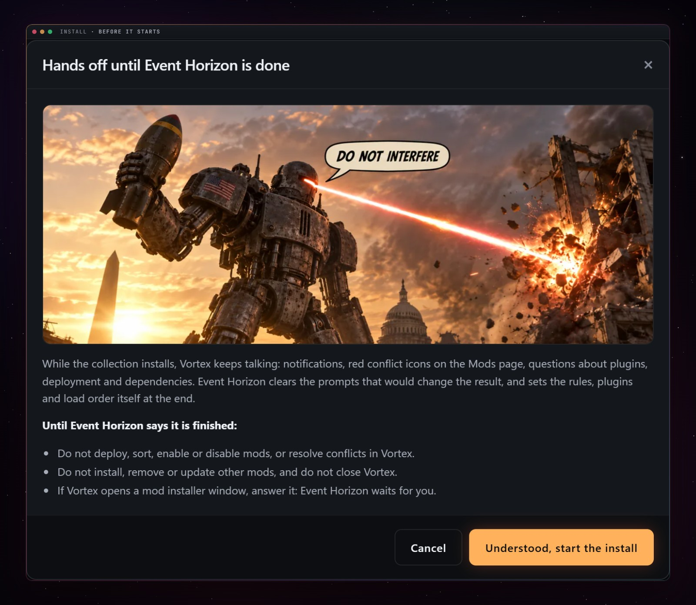</p>

## Install

1. Download the archive from the [Nexus page](https://www.nexusmods.com/site/mods/2235).
2. In Vortex, open **Extensions** and drop the zip onto the drop zone at the bottom of the list.
3. Restart Vortex. **Event Horizon** appears in the sidebar; there is nothing to configure.

Vortex does not offer Event Horizon updates by itself yet: download each new version and install it the same way.

**Requires Vortex 2.x** — built against `@nexusmods/vortex-api` 2.6.0-beta.2 (React 18); it does not run on Vortex 1.16. **Windows, or Linux and Steam Deck through Proton**: Event Horizon reads its own packages with its own ZIP reader, so nothing extra is spawned inside a Proton prefix; a 950-mod collection has been installed and verified under umu/Proton.

**Games:** Skyrim Special Edition, Fallout 4, Fallout 3, Fallout: New Vegas and Starfield, Steam and GOG copies both handled. Proven on a Fallout 4 collection of about 1,000 mods and a Skyrim Special Edition collection of about 1,750.

## Documentation

| Doc | Read it for |
| --- | --- |
| [`CHANGELOG.md`](CHANGELOG.md) | Every change, newest first, written for the people who use it |
| [`docs/business/`](docs/business/) | Per-operation behaviour in plain English: failure modes, edge cases, invariants |
| [`docs/ARCHITECTURE.md`](docs/ARCHITECTURE.md) | Code layout and execution flow |
| [`docs/DATA_FORMATS.md`](docs/DATA_FORMATS.md) | The exact shape of every JSON file read or written |
| [`docs/DISTRIBUTING_COLLECTIONS.md`](docs/DISTRIBUTING_COLLECTIONS.md) | Getting a collection to players |
| [`docs/UI_PRIMITIVES.md`](docs/UI_PRIMITIVES.md) | The UI vocabulary every screen is built from |
| [`docs/DEVELOPMENT.md`](docs/DEVELOPMENT.md) | Build, deploy, debug |
| [`docs/PUBLISHING.md`](docs/PUBLISHING.md) | Getting the extension to Vortex users |

When a doc and the code disagree, the doc is the spec and the code is the bug, until someone proves otherwise.

## Development

```
npm test                 # vitest — the whole suite, including a render of every screen
npm run typecheck        # tsc --noEmit
npm run ui:shots         # photograph every screen with headless Edge
npm run ui:check         # compare the photographs with their golden fingerprints
npm run package:extension
npm run release          # publish to Nexus and GitHub from CHANGELOG.md
```

TypeScript, strict, ES2019, CommonJS, no bundler, no runtime dependencies. Reading a `.ehcoll` uses a hand-written zero-dependency ZIP reader; writing one still uses Vortex's 7-Zip, because packaging is curator-side and the Proton failure is user-side.

## Credits

Built by **DuduPhudu** and **Bluuuk**.

- **Vortex and the Nexus Mods team.** Event Horizon is an extension: everything it does happens inside Vortex, through Vortex's own downloads, installers and deployment.
- **LOOT.** The place your own plugins take between the collection's is LOOT's work.
- **Every mod author** whose work ends up in a collection. Event Horizon downloads each mod from its author's own Nexus page.

Source available under the [PolyForm Strict License 1.0.0](LICENSE): you may use Event Horizon, but not copy, change or redistribute its code without written permission. Versions 0.1.154 and earlier were MIT.

<p align="center"></p>

<p align="center"><i>Vortex is a black hole. Collections, rules, installer answers, load orders — they all get pulled in and never come out the same on the other side. Event Horizon is the boundary that captures everything before it crosses over.</i></p>
