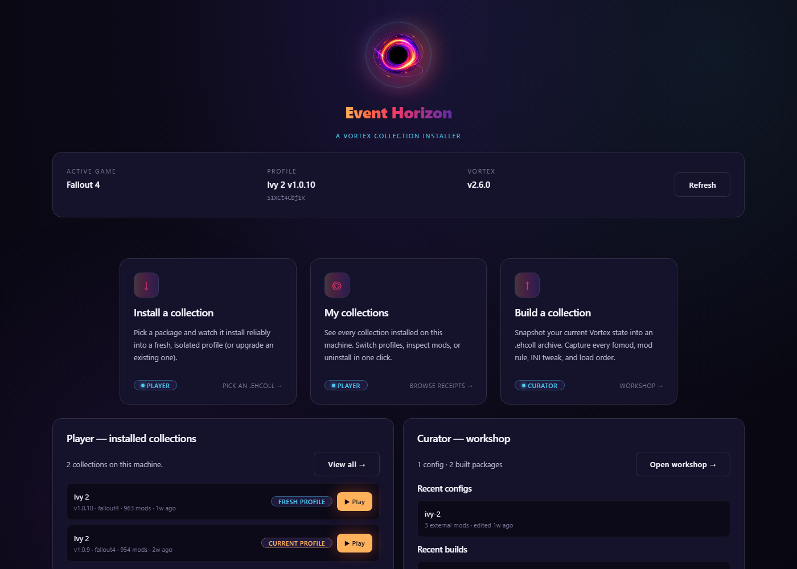
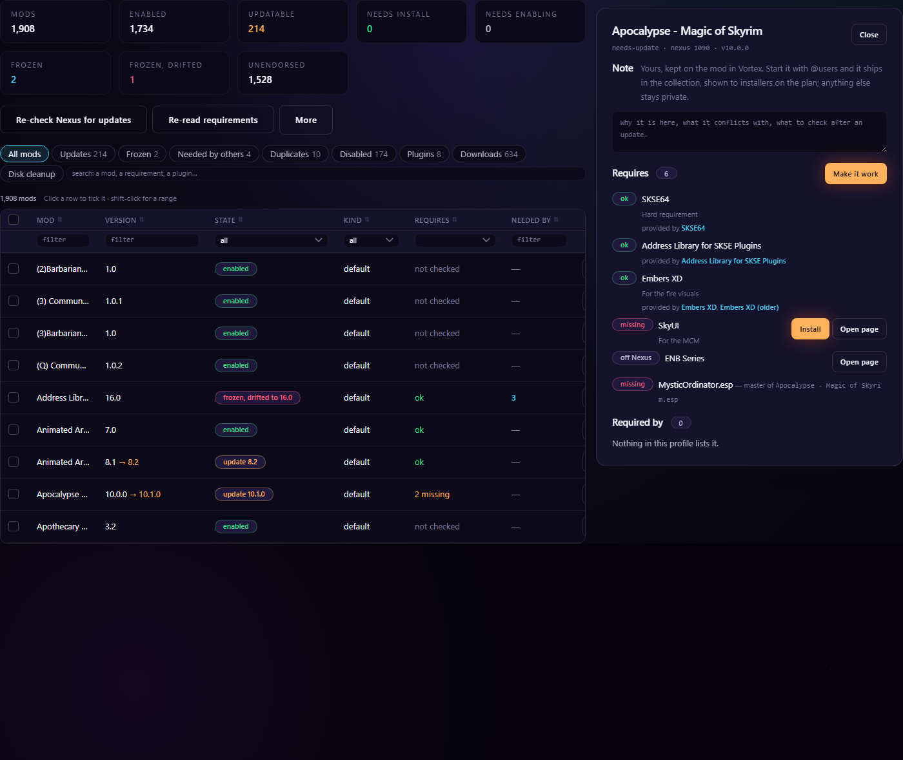
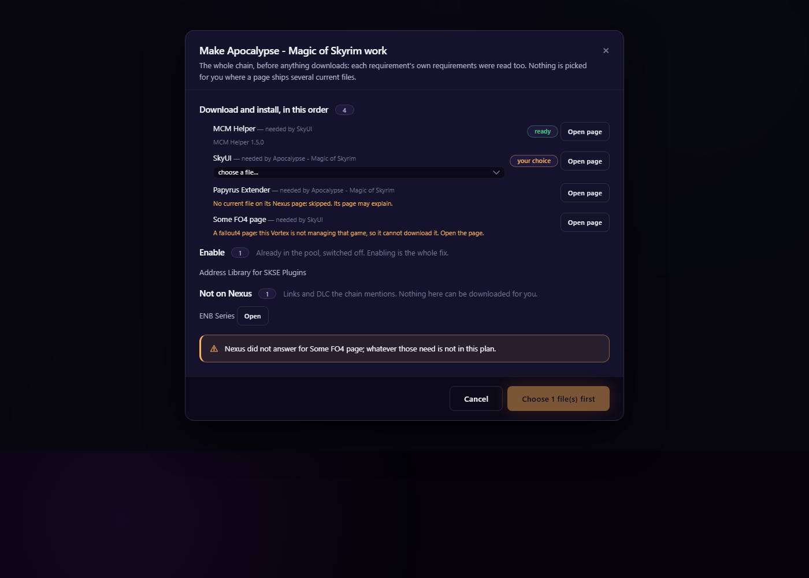
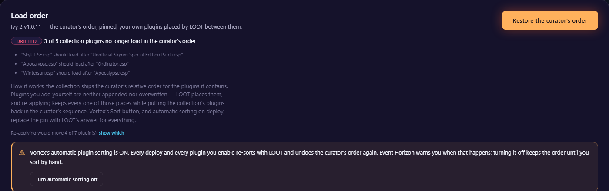
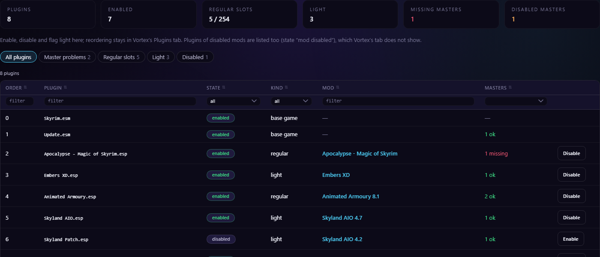
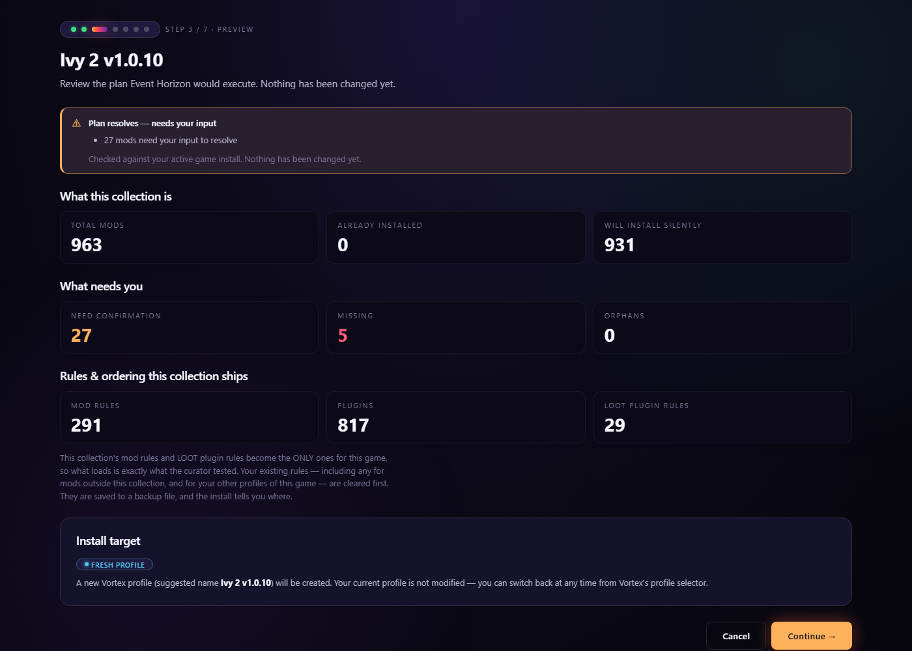
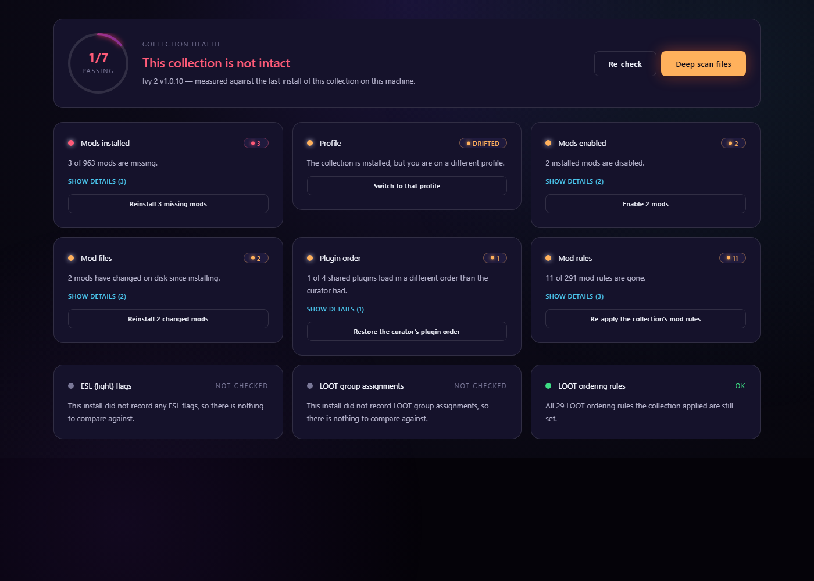

<p align="center">
  
</p>

<h1 align="center">Event Horizon</h1>

<p align="center"><b>Build a collection that arrives the way you built it. Then keep it that way.</b></p>

<p align="center">
  <a href="https://www.nexusmods.com/site/mods/2235"></a>
  
  
  
  <a href="LICENSE"></a>
</p>

A [Vortex](https://www.nexusmods.com/about/vortex/) extension in two halves. **Curators** get a workbench that sees their whole profile at once, reads what every mod requires, installs what is missing, and packs the exact working setup into a hash-verified `.ehcoll`. **Players** get an installer that rebuilds that setup one mod at a time, proves every archive matches, pins the curator's load order, and tells them the moment anything drifts.

> A Vortex Collection is a list of mods: *"here are the mods, install them."*
> An Event Horizon package is a snapshot of a setup that worked: *"here is the exact state, rebuild it, and prove it matches."*

<p align="center"></p>

---

## What you see

<table>
<tr>
<td width="50%"><br><sub><b>Curator Tools.</b> One table for the whole profile. Every mod's requirements resolved against what you have; the inspector shows what a mod needs and who needs it.</sub></td>
<td width="50%"><br><sub><b>Make it work.</b> The whole chain of what a mod is missing, read to the bottom, previewed, then installed in dependency order.</sub></td>
</tr>
<tr>
<td><br><sub><b>Load order, watched.</b> The curator's order is pinned; your own plugins keep the places LOOT gives them. When a sort undoes it, you are told, with the fix on the notification.</sub></td>
<td><br><sub><b>Plugins.</b> Which mod ships each plugin, missing versus disabled masters, the light flag, and the regular-slot count against the game's plugin limit.</sub></td>
</tr>
<tr>
<td><br><sub><b>Installing a collection.</b> The verdict first, then the plan. Nothing changes until you say so.</sub></td>
<td><br><sub><b>Collection Doctor.</b> Is it still what was installed? Answered per aspect, never as one green tick, with the repair on the card.</sub></td>
</tr>
</table>

---

## For players

**Install a collection.** Drop a `.ehcoll`. The plan is shown before anything is written: what you already have, what will install silently, what needs you, what cannot be downloaded any more. Your game setup is checked first — an unmanaged game, a never-started game, a file from a different store's copy, an install under Program Files — and the install stops with the steps to fix it rather than an hour later.

**It installs one mod at a time.** Vortex loses files when mods install concurrently; sequential is a correctness property here, not a performance oversight. Every archive is hashed against the manifest and reported as *matches*, *differs*, *damaged* or *unknown*. The curator's FOMOD answers are replayed; you choose once whether to watch them or let them apply.

**The load order is the curator's, and it stays that way.** The install pins the curator's order for the collection's plugins, lets LOOT place your own plugins between them, then puts the collection's plugins back in the curator's sequence. Afterwards Event Horizon watches: the moment Vortex's automatic sort or a Sort click replaces that order, a notification says so, with **Re-apply curator's order** on it. Home and Doctor show the state at a glance.

**Collection Doctor.** Profile, mods present, mods enabled, staged files, plugin order, ESL flags, mod rules, LOOT rules: each in five states, and *unknown* is never shown as *fine*. Every finding that can be repaired has the repair on the card, run through the same step the install used.

**An interrupted install continues where it stopped**, in the same profile, even after Vortex was killed. A finished install writes a receipt; a failed or cancelled one records where it stopped; all of them show under **My Collections**.

**Linux and Steam Deck are supported targets.** Event Horizon reads its own packages with its own ZIP reader, so nothing is spawned in a Proton prefix that can fail for reasons unrelated to your files. A 950-mod collection has been installed and verified under umu/Proton.

---

## For curators

**Curator Tools is one workbench.** Your whole profile in one table: updates, manual updates, frozen mods, missing requirements, mods others depend on, duplicates, disabled, outside-Data kinds, non-Nexus archives. Views combine, a search box finds a mod, a requirement, a plugin or a provider by name, and the action bar offers only what applies to what you ticked.

- **Requirements, read and acted on.** Every mod's Nexus requirements and every plugin's masters, resolved against your pool: satisfied, installed but disabled, missing, off Nexus, DLC. Each line gets the one action that fits. Enabling a mod enables the providers it lists; disabling a provider tells you who needs it and offers to take them down too.
- **Make it work.** One button reads the whole chain of what a mod is missing — each requirement's own requirements too — shows the plan, lets you choose where a page ships several files, then installs in dependency order and waits for each to land. Without Nexus Premium it runs guided, opening each page in turn.
- **Bulk update, one mod at a time, each verified** against its archive afterwards. **Freeze** a mod at a version and be told loudly if Vortex's own update button moves it anyway. **Endorse** with Nexus's answer read back per mod.
- **Plugins**: the mod that ships each plugin, missing versus disabled masters, light flags, the slot count. Enable, disable and flag light from here.
- **Downloads** nothing was ever made from, installed on request; **Disk cleanup** that never chooses removals for you and separates proven old versions from files that merely share a page.
- **Notes** on a mod. Start one with `@users` and it ships in the collection, shown to installers under *From the curator*.

**Build.** The build asks Nexus about every mod in your collection and separates *file gone* from *page gone* — you are the one person who cannot notice, because your copy is already on disk. A mod that can no longer be downloaded ships as an external dependency, by hash, with a bundle, a link or instructions. Mirroring reproduces your staging folder byte for byte; a fourth FOMOD answer, *leave it out*, is measured instead of guessed; two builds cannot share a version number.

---

## Two things it will do that you should know about

1. **It replaces your mod rules and LOOT userlist. It does not merge them.** Everything is backed up first, and the backup reaching disk is a hard interlock. Merging produces a rule set that exists on nobody else's machine and fails invisibly: every file verifies and the game still loads something different.
2. **Nexus Premium is recommended, not required.** Without it, large installs and *Make it work* run guided: one page opened at a time, one "Mod manager download" click from you per mod.

## Which mod wins a file

When two mods ship the same file, the winner comes from the collection's mod rules, which the install applies. Measured on a 1,753-mod collection, the rules reproduce the curator's winner for 17,159 of 17,161 contested files; the other two are a `Readme.txt` and a `FOMod/info.xml`, which the game never loads.

---

## Install the extension

1. Download the archive from the [Nexus page](https://www.nexusmods.com/site/mods/2235).
2. In Vortex, open **Extensions** and drop the zip onto the drop zone at the bottom of the list.
3. Restart Vortex. **Event Horizon** appears in the sidebar.

Requires **Vortex 2.x**. Built against `@nexusmods/vortex-api` 2.6.0-beta.2 (React 18); it will not run on Vortex 1.16. Windows, and Linux via Proton.

**Games:** Skyrim Special Edition, Fallout 4, Fallout 3, Fallout New Vegas, Starfield. Proven on a 950-mod Fallout 4 collection and a 1,900-mod Skyrim SE profile.

---

## Documentation

| Doc | Read it for |
| --- | --- |
| [`CHANGELOG.md`](CHANGELOG.md) | Every change, newest first, written for the people who use it |
| [`docs/business/`](docs/business/) | Per-operation behaviour in plain English: failure modes, edge cases, invariants |
| [`docs/ARCHITECTURE.md`](docs/ARCHITECTURE.md) | Code layout and execution flow |
| [`docs/DATA_FORMATS.md`](docs/DATA_FORMATS.md) | The exact shape of every JSON file read or written |
| [`docs/UI_PRIMITIVES.md`](docs/UI_PRIMITIVES.md) | The UI vocabulary every screen is built from |
| [`docs/DEVELOPMENT.md`](docs/DEVELOPMENT.md) | Build, deploy, debug |
| [`docs/PUBLISHING.md`](docs/PUBLISHING.md) | Getting the extension to Vortex users |

When a doc and the code disagree, the doc is the spec and the code is the bug, until someone proves otherwise.

## Development

```
npm test                 # vitest — 2,600+ tests, including a render of every screen
npm run typecheck        # tsc --noEmit
npm run ui:shots         # photograph every screen with headless Edge
npm run ui:check         # compare the photographs with their golden fingerprints
npm run package:extension
npm run release          # publish to Nexus and GitHub from CHANGELOG.md
```

TypeScript, strict, ES2019, CommonJS, no bundler, no runtime dependencies. Reading a `.ehcoll` uses a hand-written zero-dependency ZIP reader; writing one still uses Vortex's 7-Zip, because packaging is curator-side and the Proton failure is user-side.

## Credits

Built by **DuduPhudu** and **Bluuuk**. Source available under the [PolyForm Strict License 1.0.0](LICENSE): you may use Event Horizon, but not copy, change or redistribute its code without written permission. Versions 0.1.154 and earlier were MIT.

<p align="center"><i>Vortex is a black hole. Collections, rules, FOMOD selections, conflict overrides — they all get pulled in and never come out the same on the other side. Event Horizon is the boundary that captures everything before it crosses over.</i></p>
